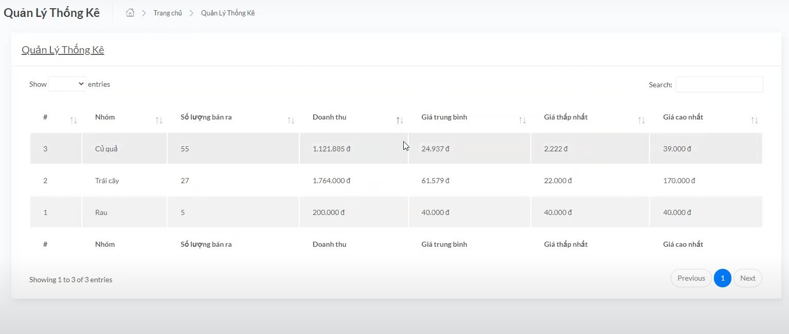

<div align="left">
    <div align="center">
        <h1>Greeny</h1>
        <p>
            Welcome to Greeny - the paradise of fresh and healthy fruits! At Greeny, we take pride in offering high-quality, clean fruits carefully selected from reputable farms. With our commitment to providing fresh products every day, Greeny ensures abundant nutrition and delightful flavors. Experience nature's freshness with Greeny and build a healthy lifestyle today!
        </p>
    </div>
    <!-- Badges -->
    <br />
    <div align="center">
        <p>
            <a href="https://github.com/hoangan-vn/greeny/graphs/contributors">
                
            </a>
            <a href="">
                
            </a>
            <a href="https://github.com/hoangan-vn/greeny/network/members">
                
            </a>
            <a href="https://github.com/hoangan-vn/greeny/stargazers">
                
            </a>
            <a href="https://github.com/hoangan-vn/greeny/issues/">
                
            </a>
            <a href="https://github.com/hoangan-vn/greeny/blob/master/LICENSE">
                
            </a>
        </p>
        <h4>
            <a href="https://github.com/hoangan-vn/greeny/">View Demo</a>
            <span> · </span>
            <a href="https://github.com/hoangan-vn/greeny">Documentation</a>
            <span> · </span>
            <a href="https://github.com/hoangan-vn/greeny/issues/">Report Bug</a>
            <span> · </span>
            <a href="https://github.com/hoangan-vn/greeny/issues/">Request Feature</a>
        </h4>
    </div>
</div>
<br />

<!-- Table of Contents -->
# :notebook_with_decorative_cover: Table of Contents

- [:notebook\_with\_decorative\_cover: Table of Contents](#notebook_with_decorative_cover-table-of-contents)
  - [:sparkles: About the Project](#sparkles-about-the-project)
    - [:camera: Screenshots](#camera-screenshots)
      - [:handshake: Client](#handshake-client)
      - [:man\_in\_tuxedo: Admin](#man_in_tuxedo-admin)
    - [:space\_invader: Tech Stack](#space_invader-tech-stack)
    - [:dart: Features](#dart-features)
    - [:art: Color Reference](#art-color-reference)
    - [:key: Environment Variables](#key-environment-variables)
  - [:toolbox: Getting Started](#toolbox-getting-started)
  - [:wave: Contributing](#wave-contributing)
  - [:warning: License](#warning-license)
  - [:handshake: Contact](#handshake-contact)
  - [:gem: Acknowledgements](#gem-acknowledgements)

<!-- About the Project -->
## :sparkles: About the Project<a name="sparkles-about-the-project"></a>

<!-- Screenshots -->
### :camera: Screenshots<a name="camera-screenshots"></a>

<!-- Client -->
#### :handshake: Client<a name="handshake-client"></a>

| Sign in | Sign up | OTP |
| --- | --- | --- |
|  |  |  |

| Forgot Password  | Reset Password | Banner |
| --- | --- | --- |
|  |  |   |

| Bestselling products  | Discount | New Product |
| --- | --- | --- |
|  |  |  |

| Category  | Report | Product |
| --- | --- | --- |
|  |  |  |

| Product detail | Product description | Profile |
| --- | --- | --- |
|  |  |   |

| Wishlist  | Cart | Order |
| --- | --- | --- |
|  |  |   |

| Payment  | PayPal | Email success |
| --- | --- | --- |
|   |  |  |

| Order detail  | Not found |
| --- | --- |
|  |  |

<!-- Admin -->
#### :man_in_tuxedo: Admin<a name="man_in_tuxedo-admin"></a>

| Home  | Order | Product |
| --- | --- | --- |
|  |  |  |

| Statistics  |
| --- | 
|  |

<!-- TechStack -->
### :space_invader: Tech Stack<a name="space_invader-tech-stack"></a>

<details>
  <summary>Frontend</summary>
  <ul>
    <li><a href="https://developer.mozilla.org/en-US/docs/Web/HTML">HTML</a></li>
    <li><a href="https://developer.mozilla.org/en-US/docs/Web/CSS">CSS</a></li>
    <li><a href="https://getbootstrap.com/">Bootstrap</a></li>
    <li><a href="https://jquery.com/">jQuery</a></li>
  </ul>
</details>

<details>
  <summary>Server</summary>
  <ul>
    <li><a href="https://www.java.com/en/">Java</a></li>
    <li><a href="https://spring.io/">Spring boot</a></li>
    <li><a href="https://www.mysql.com/">MySQL</a></li>
  </ul>
</details>

<details>
<summary>DevOps</summary>
  <ul>
    <li><a href="https://www.gtihub.com/">Github</a></li>
    <li><a href="https://www.gtihub.com/">Github Action</a></li>
    <li><a href="https://vercel.com/">Vercel</a></li>
    </li>
  </ul>
</details>

<!-- Features -->
### :dart: Features

- Sign in
- Sign up
- OTP Authentication
- Forgot Password
- Reset Password
- Banner Ads
- Bestselling Products
- Discounts
- New Products
- Product Categories
- Reports
- Product Listings
- Product Details
- Product Descriptions
- User Profile
- Wishlist
- Shopping Cart
- Orders
- Payment
- PayPal Payment
- Email Success Notification
- Order Details
- 404 Not Found Page
- Admin Home
- Order Management
- Product Management
- Statistics

<!-- Color Reference -->
### :art: Color Reference

| Color  | Hex  |
| --- | --- |
| Primary Color |  #28a745 |
| Accent Color |  #8C8A8A |
| Text Color |  #000000 |

<!-- Env Variables -->
### :key: Environment Variables

To run this project, you will need to add the following environment variables to your application.properties file

`spring.datasource.url`

`spring.datasource.username`

`spring.datasource.password`

`spring.datasource.driver-class-name`

`spring.jpa.properties.hibernate.dialect`

`spring.jpa.show-sql`

`spring.jpa.properties.hibernate.format_sql`

`spring.jpa.hibernate.ddl-auto`

`spring.mail.host`

`spring.mail.port`

`spring.mail.username`

`spring.mail.password`

`spring.mail.properties.mail.smpt.auth`

`spring.mail.properties.mail.smtp.starttls.enable`

`server.error.whitelabel.enabled`

`server.error.path`

`upload.path`

`spring.servlet.multipart.max-file-size`

`spring.servlet.multipart.max-request-size`

`paypal.mode`

`paypal.client.app`

`paypal.client.secret`

<!-- Getting Started -->
## :toolbox: Getting Started

<!-- Contributing -->
## :wave: Contributing

<a href="https://github.com/hoangan-vn/greeny/graphs/contributors">
  
</a>

Contributions are always welcome!
See `contributing.md` for ways to get started.

<!-- License -->
## :warning: License

Distributed under the MIT License. See ```LICENSE``` for more information.

<!-- Contact -->
## :handshake: Contact

Hoang An -  <hoangan072024@gmail.com> - <+84 779672566>

Project Link: [https://github.com/hoangan-vn/greeny](https://github.com/hoangan-vn/greeny)

<!-- Acknowledgments -->
## :gem: Acknowledgements

In Greeny project, I used some useful resources and libraries to aid the development process.

- [Bootstrap](https://getbootstrap.com/)
- [jQuery](https://jquery.com/)
- [Spring boot](https://spring.io/)
- [MySQL](https://www.mysql.com/)
